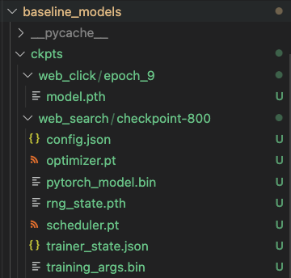

# 🤖 WebShop Baseline Models

This repository contains the source code for the baseline models discussed in the original paper, along with instructions for training the models and running them on WebShop.
## 🚀 Set Up
* Install additional dependencies via `pip install -r requirements.txt`
* Download the training data for choice IL and place it into the `data` folder
```bash
cd data
unzip il_trajs_finalized_images.zip
cd ..
```
* Download the trained model checkpoints for search and choice IL from [here](https://drive.google.com/drive/folders/1liZmB1J38yY_zsokJAxRfN8xVO1B_YmD?usp=sharing).

When running the scripts discussed below, by default, the code will seek out the model parameters specified in the files/folders of the trained model checkpoints as:
* `./ckpts/web_click/epoch_9/model.pth` for `choice_il_epoch9.pth`
* `./ckpts/web_search/checkpoint-800` for `checkpoints-800/` (from `search_il_checkpoints_800.zip`)

We recommend creating these directories and putting the renamed files in the aforementioned, corresponding locations. If you are currently in this directory (`baseline_models`) and have the model checkpoints `.zip` file in your `Downloads` folder, these commands should do the trick.
```bash
mkdir -p ckpts/web_click/epoch_9/
mkdir -p ckpts/web_search/
mv ~/Downloads/choice_il_epoch9.pth ~/Downloads/model.pth
mv ~/Downloads/model.pth ckpts/web_click/epoch_9/
mv ~/Downloads/search_il_checkpoints_800.zip ckpts/web_search/
unzip ckpts/web_search_il_checkpoints_800.zip
```

Your final layout should look like this:
<p float="left">
    
</p>


On the other hand, if you'd like to put the files in a custom location, you can specify the custom file paths as arguments for the `test.py` as described below.

## 🛠️ Usage
➤ Train the **search IL model** (BART Transformer):
> Note: Trained values will be output to `./ckpts/web_search` based on this [line](https://github.com/princeton-nlp/WebShop/blob/master/baseline_models/train_search_il.py#L119)
```bash
python train_search.py
```

➤ Train the **choice IL model** (BERT Transformer):
> Notes: Trained values will be output to `./ckpts/web_choice` based on this [line](https://github.com/princeton-nlp/WebShop/blob/master/baseline_models/train_choice_il.py#L299); List of Arguments [here](https://github.com/princeton-nlp/WebShop/blob/master/baseline_models/train_choice_il.py#L213) 
```bash
python train_choice.py
```

➤ Train the **choice RL** models
> Note: List of Arguments [here](https://github.com/princeton-nlp/WebShop/blob/master/baseline_models/train_rl.py#L171)
```bash
python train_rl.py
```

## 🧪 Testing
- Test the model on WebShop:
```bash
python test.py
```
- List of Arguments [here](https://github.com/princeton-nlp/WebShop/blob/master/baseline_models/test.py#L86)
    - `--model_path` should point to the `choice_il_epoch9.pth` file
    - `--bart_path` should point to the `checkpoints-800/` folder

### 📙 Notes about Testing
1. You can specify the choice model path (`--model_path`) and the search model path (`--bart_path`) to load different models. 
    
2. While the rule baseline result is deterministic, model results could have variance due to the softmax sampling of the choice policy. `--softmax 0` will use a greedy policy and yield deterministic (but worse) results.

3. `--bart 0` will use the user instruction as the only search query.

## 🔀 Miscellaneous
Generate the search IL model's top-10 queries on all WebShop instructions:
```bash
# Will generate ./data/goal_query_predict.json
python generate_search.py
```

