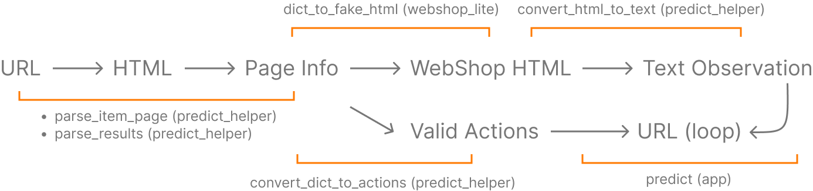

# Sim-to-real Transfer
This folder contains code for transferring agents trained on WebShop to perform on third party websites, specifically [Amazon](http://amazon.com) and [eBay](http://ebay.com). The imitation learning and reinforcement learning agents exercised by the transfer code can be found on WebShop's Hugging Face [page](https://huggingface.co/webshop).

Interact with a demo of the transfer code, deployed as a 🤗 Hugging Face space [here](https://huggingface.co/spaces/webshop/amazon_shop)!

## 🛠️ Usage
The Gradio app deployed as the aforementioned Hugging Face space can be started locally by running `python app.py` in this folder. The initial `setup.sh` script should have installed all the required dependencies.

## ➡️ Transfer Logic
The Sim-to-real transfer code follows this general logical flow:

The contents of this directory each serve the following purposes:
* `app.py`: Run to launch interactive [Gradio](https://gradio.app/) demo of app
* `predict_help.py`: Amazon, eBay web scraping code
* `webshop_lite.py`: A condensed version of WebShop's templating engine

If you are interested in *transferring an agent's functionality to an new website or platform*, you will need to...
1. implement two new functions:  `parse_results_<platform>.py` and `parse_item_page_<platform>.py`. The corresponding interfaces and working examples for Amazon can be found [here](https://github.com/princeton-nlp/webshop/tree/master/transfer/predict_help.py#L262) and [here](https://github.com/princeton-nlp/webshop/tree/master/transfer/predict_help.py#L296).
2. Invoke these functions in the [`run_episode`](https://github.com/princeton-nlp/webshop/tree/master/transfer/app.py#L105) function in the `app.py` file. Specifically, you should add a single call to...
     * `parse_results...` in the [conditional]((https://github.com/princeton-nlp/webshop/tree/master/transfer/predict_help.py#L220)) handling `Page.RESULTS` page types
     * `parse_item_page...` in the [conditional]((https://github.com/princeton-nlp/webshop/tree/master/transfer/predict_help.py#L240)) handling `Page.ITEMS` page types