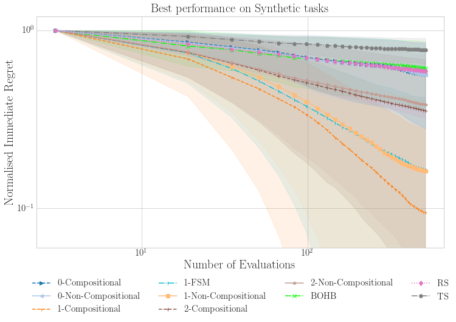

# Bayesian Optimisation with Compositional Optimisers 

Bayesian optimisation codebase developed by Huawei R&D, Noah's Ark Lab (London), for
[Are we Forgetting about Compositional Optimisers in Bayesian Optimisation?](https://jmlr.org/papers/v22/20-1422.html) experimental section.

<div style="text-align:center">

## Features

This codebase contains:
 - Implementations of [compositional](./core/comp_acquisition) and [FS](./core/comp_acquisition/mc_fs_acquisition.py) 
 forms for myopic acquisition functions adapted from `botorch` package.
 - Implementations of [compositional optimisers](./custom_optimizer): `CAdam`, `NASA`
, `SCGD` and `ASCGD`, which can be used to maximise the acquisition function written in a nested form.
 - [Notebooks](./notebooks) providing demo on the [use of compositional optimisers](./notebooks/cadam_demo.ipynb) and 
 on the use of the [`BayesOptimisation`](./core/bayes_opt.py) class to [perform BO](./notebooks/bo_demo.ipynb) with various acquisition functions and 
 optimisers.

## Running BO: example of black-box optimisation

##### Get black-box function Ackley-16D
```python
import numpy as np
import torch
from torch import Tensor
from typing import *

import sys, os
ROOT_PROJECT =  os.path.join(os.path.normpath(os.path.join(os.getcwd(), "../"))) 
sys.path[0] = ROOT_PROJECT

from core.utils.utils_query import query_optimizer, query_test_func

cuda = 0
tkwargs = dict(dtype=torch.double, device=torch.device(f"cuda:{cuda}" if torch.cuda.is_available() and cuda is not None else "cpu"))

test_func = 'Ackley'
input_dim = 16
negate = True  # we maximise -f

testfunc = query_test_func(test_func, input_dim, negate).to(**tkwargs)
optimal_value = testfunc.optimal_value
bounds: Tensor = testfunc.bounds  # shape (2, d)
```

##### Specify search space through a ParamSpace instance
```python
from core.params_helper import ParamSpace

# Hyper-rectangle search space
search_bounds = [
    {'name': f'x_{i}', 'type': 'continuous', 'domain': (bounds[0, i].item(), bounds[1, i].item())} for i in
    range(input_dim)
]

# List of transformations to apply to the search domain for BO search (could consider log-domain
# or any bijective transformation, but here there is no modification needed)
search_real_transfo = [
    {f'x_{i}': lambda w: w} for i in range(input_dim)
]

params_h = ParamSpace(search_bounds, search_real_transfo)
```

##### Specify BO configurations

```python
# Number of initial points
num_initial =  2 * input_dim

# See arguments Docstrings of `core.bayes_opt.BayesOptimization` class for further details on BO setup
bo_kwargs = dict(
    params_h=params_h,
    negate = False,
    initial_design_numdata = num_initial,
    num_MC_samples_acq = 128,
    num_raw_samples = 500,
    num_starts = 32,
    num_opt_steps = 128,
    device=cuda
)

q = 16              # Number of points acquired at each acquisition step
num_acq_steps = 15  # Number of acquisition steps
```
##### BO with UCB maximised using CAdam-ME optimiser 
```python
# Choose acquisition function and optimiser
acq_func = 'qCompositionalUpperConfidenceBound' 
acq_func_kwargs = {'beta': 2}
optimizer = 'CAdam-ME'
optimizer_kwargs = {'lr':0.1,'beta':0.08,'mu':0.9}
```

##### Main loop
```python
from core.bayes_opt import BayesOptimization

regrets = []
best_values: List[float] = []  # store best values observed after each acquisition step
bo = BayesOptimization(acq_func=acq_func, acq_func_kwargs=acq_func_kwargs, optimizer=optimizer, optimizer_kwargs=optimizer_kwargs, **bo_kwargs)

# initial random points:
Xs: List[Dict[str, float]] = bo.gen(num_initial)
# evaluate initial points
X_to_eval: Tensor = torch.tensor(np.array([params_h.get_list_params_from_dict(X) for X in Xs])).to(**tkwargs)
# Add them to the observed dataset of `bo` instance
bo.observe(Xs, testfunc(X_to_eval))

best_values.append(bo.data_Y.max().item())  # contains best value observed after initialisation

for acq_step in range(num_acq_steps):
    # Generate points by maximising the acquisition function 
    Xs: List[Dict[str, float]] = bo.gen(q)
    
    # Evaluate suggested points
    X_to_eval: Tensor = torch.tensor(np.array([params_h.get_list_params_from_dict(X) for X in Xs]))
    new_values = testfunc(X_to_eval)
    
    # Observe the new input-output data
    bo.observe(Xs, new_values)
    
    best_values.append(max(best_values[-1], new_values.max().item()))

regrets = optimal_value - np.array(best_values)
```
---
## Citing this project
If you use this codebase, please cite the following paper:
> A. Grosnit\*, A. I. Cowen-Rivers\*, R. Tutunov\*, R.-R. Griffiths, J. Wang, and H. Bou-Ammar.
> Are we Forgetting about Compositional Optimisers in Bayesian Optimisation?, 2020.
```shell script
@article{JMLR:v22:20-1422,
  author  = {Antoine Grosnit and Alexander I. Cowen-Rivers and Rasul Tutunov and Ryan-Rhys Griffiths and Jun Wang and Haitham Bou-Ammar},
  title   = {Are We Forgetting about Compositional Optimisers in Bayesian Optimisation?},
  journal = {Journal of Machine Learning Research},
  year    = {2021},
  volume  = {22},
  number  = {160},
  pages   = {1-78},
  url     = {http://jmlr.org/papers/v22/20-1422.html}
}
```

If you use CAdam, please also cite the following paper:
> [R. Tutunov, M. Li, J. Wang and H. Bou-Ammar. Compositional ADAM: An Adaptive Compositional Solver, 2020.](https://arxiv.org/abs/2002.03755)
```shell script
@article{tutunov2020cadam,
  title={Compositional {ADAM}: {A}n Adaptive Compositional Solver},
  author={Tutunov, Rasul and Li, Minne and Wang, Jun and Bou-Ammar, Haitham},
  journal={arXiv preprint arXiv:2002.03755},
  year={2020}
}
```
