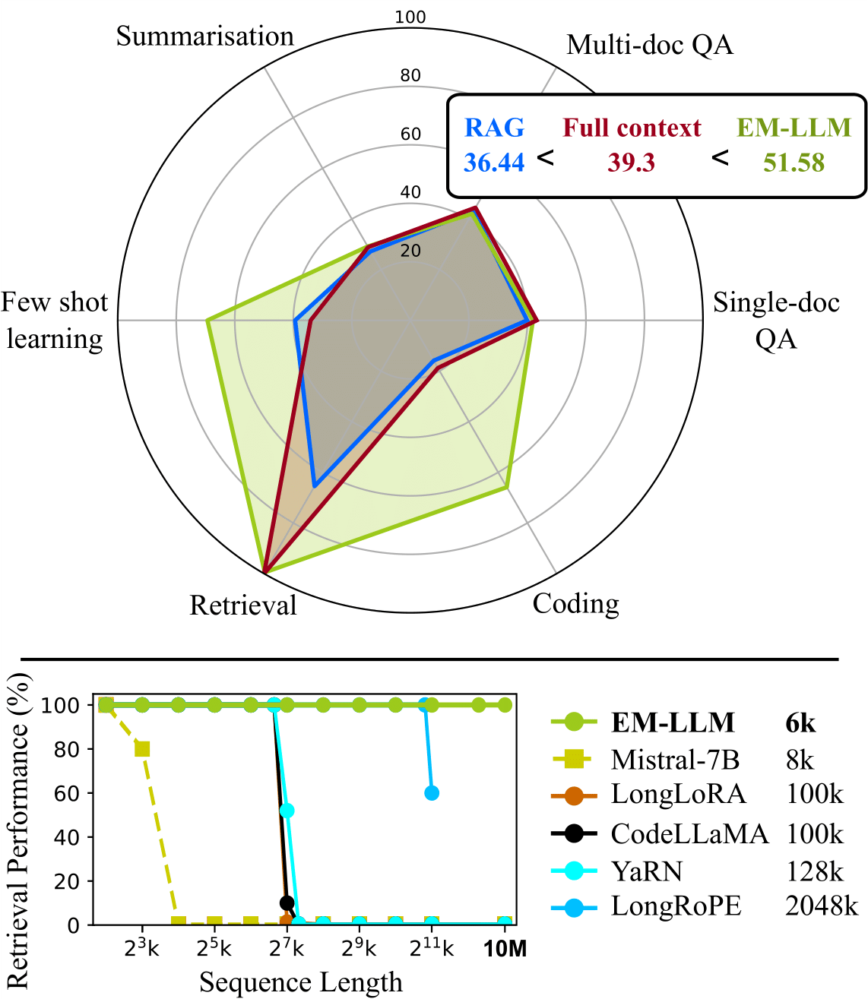

# EM-LLM: Human-like Episodic Memory for Infinite Context LLMs

This repository contains a version of the code for EM-LLM: [[arXiv]](https://arxiv.org/abs/2407.09450).

## Quick Links
* [Overview](#overview)
* [Usage](#usage)
* [Citation](#citation)

## Overview

While typical LLMs struggle with processing extensive contexts, the human brain excels at organising and retrieving experiences spanning a lifetime. In this work, we introduce EM-LLM, an architecture that integrates key aspects of human episodic memory and event cognition into LLMs with **no fine-tuning**, enabling them to handle practically infinite context lengths while maintaining computational efficiency. EM-LLM organises sequences of tokens into coherent episodic events using a combination of Bayesian surprise and graph-theoretic boundary refinement in an online fashion. When needed, these events are retrieved through a two-stage memory process, combining similarity-based and temporally contiguous retrieval for efficient and human-like access to relevant information. Experiments on the LongBench and $\infty$-Bench benchmarks demonstrate EM-LLM's superior performance, consistently outperforming the SOTA retrieval model InfLLM across various baseline LLMs. In addition, EM-LLM **outperforms RAG** in a wide range of tasks, while requiring similar resources. Notably, EM-LLM's performance even **surpasses full-context models** in most tasks, while successfully performing retrieval across **10M tokens** - a scale computationally infeasible for such models. Our analysis reveals strong correlations between EM-LLM's event segmentation and human-perceived events, suggesting a bridge between this artificial system and its biological counterpart, thereby offering a novel computational framework for exploring human memory mechanisms.


### Architecture
<div align="center">

  

</div>

**Figure 1:**  Architecture of memory formation and retrieval in each LLM layer. *Formation:* Input sequence is initially segmented via surprise (purple dashed lines in ①), then segmentation is refined based on group theoretic metrics (green dashed lines in ②). Initial tokens and local context are preserved. *Retrieval:* via both k-NN search ③ and selecting contiguous events from episodic memory ④.

### Results

Click [here](/EM-LLM/benchmark/further_results.md) more complete result tables.

<div align="center">

  

</div>

**Figure 2:** **(Left)** EM-LLM$_S$ vs. RAG (NV-Embed-v2 retriever) vs. full-context, with LLaMA-3.1-8B as the base LLM, evaluated on LongBench. **(Right)** Comparison of various long-sequence methods (sorted based on their context window length) on an extended version of $\infty$-Bench's _Retrieve.PassKey_.


## Usage

### Configuration

Install requirements:

```
python3 -m pip install --upgrade pip
pip install -r "${base_dir}/requirements.txt"
pip install -e "${base_dir}/."
```

The YAML files used for configuration can be found in the `config/` directory. 

Here is a breakdown of each parameter included in these files:

```yaml
verbose: false  # print the question/prediction/answer after an example has been processed 
compute_ppl: true  # print and log perplexity for each example/chunk
return_block_size: true  # print and log block size for each example/chunk
logging: true  # save logs to output directory and label individual worker logs during multiprocessing
em_splitter: surprisal  # method by which to split chunks into memory blocks (surprisal, random, sentence)

max_len: 2147483647  # maximum sequence length before truncation is used
chunk_size: 512  # size of chunked input during decoding
conv_type: mistral-inst  # conversation template type

extended_passkey: 1024  # length to extend infinite-bench's passkey task to in terms of thousands of tokens (k)

model:
  type: em-llm  # Which model to use for inference (only em-llm is made available in this version)
  path: mistralai/Mistral-7B-Instruct-v0.2  # HuggingFace model path
  min_block_size: 8  # the smallest possible block size - blocks smaller than this will be expanded to this size
  max_block_size: 128  # the biggest possible block size - blocks bigger than this will be split to this size
  n_init: 128  # number of initial tokens to include in context window
  n_local: 4096  # number of local tokens to include in context window
  n_mem: 2048  # number of retrieved tokens to include in context window (includes both the similarity and contiguity buffers)
  repr_topk: 4  # number of top-scoring tokens per memory unit considered as representative elements
  max_cached_block: 512  # number of memory blocks to keep in GPU memory - must be greater than n_mem/min_block_size
  exc_block_size: 512  # number of tokens queried at a time as an execution block - each execution block performs retrieval of n_mem tokens once
  base: 1000000  # RoPE base
  distance_scale: 1.0  # RoPE distance scale
  surprisal_threshold_gamma: 1.0  # the standard-deviation scaling factor in the surprisal calculation (see paper)

  min_free_cpu_memory: 100  # minimum amount CPU RAM (GB) to keep free when allocating memory blocks
  disk_offload_threshold: 300000  # number of tokens in a sequence past which disk offloading should be used
  vector_offload_threshold: 50000  # number of tokens in a sequence past which representative tokens should be offloaded to CPU memory

  similarity_refinement_kwargs:  # parameters relating directly to the boundary refinement step of our paper
    similarity_refinement: false  # whether to use boundary refinement or not
    refine_with_buffer: true  # if True, the adjacency matrix will include part of the neighbouring chunks in its calculation of the adjacency matrix - designed to make segmentations more compatible with neighbouring chunks, but also increases computation time
    refine_from_layer: 20  # which layers to use when calculating the adjacency 
    similarity_metric: modularity  # the metric to use as the objective during refinement: modularity or conductance (or intra_inter_sim but this doesn't work well so far)

  contiguity_buffer_kwargs:  # parameters relating directly to the contiguity buffer
    use_contiguity_buffer: true  # whether to use a contiguity buffer
    contiguity_buffer_size: 0.3  # proportion of n_mem tokens to dedicate to the contiguity buffer

  uniform_blocks: false  # ignore em_splitter (above) and segment chunks into fixed-sized blocks of size max_block_size (above)
  random_topk_blocks: false  # retrieve random blocks rather than the topk most similar blocks
```

### Evaluation

**Data Preparation**
We adopt $\infty$-Bench and LongBench for model evaluation. You can download the datasets by running the following command.
```
bash scripts/download.sh
```

**Response Generation**
You can evaluate EM-LLM by running the following command. You can also optionally pass in the following arguments to accomodate your hardware resources 
```
bash scripts/run.sh

    -m|--model  # DEFAULT: mistral; OPTIONS: mistral,llama3,llama31,phi3_mini,phi35_mini - Which base LLM to use during evaluation.
    -b|--benchmark  # DEFAULT: long-bench; OPTIONS: long-bench,infinite-bench,passkey - Which benchmark to evaluate. Passkey evaluates an extended version of InfiniteBench's passkey retrieval task (see yaml for context length parameter). 
    -w|--world-size  # DEFAULT: number of visible GPUs - Total number of GPUs to be used during evaluation. 
    -n|--num_gpus_per_job  # DEFAULT: 1 - How many GPUs to attribute to each job. If >1, model layers will be evenly spread over multiple GPUs. 
    -r|--rank_offset  # DEFAULT: 0 - Ignores the first n GPUs visible to the script. Useful when running multiple experiments on a single node.
    -o|--allow_disk_offload  # DEFAULT: False - Whether to allow dynamic disk offloading of memory blocks or not (see the our paper's Appendix for more details). In single-GPU instances this will offload the representative tokens to CPU memory as well.

```

## Citation
If you find EM-LLM useful, please cite the following paper:

```
@misc{fountas2024humanlikeepisodicmemoryinfinite,
      title={Human-like Episodic Memory for Infinite Context LLMs}, 
      author={Zafeirios Fountas and Martin A Benfeghoul and Adnan Oomerjee and Fenia Christopoulou and Gerasimos Lampouras and Haitham Bou-Ammar and Jun Wang},
      year={2024},
      eprint={2407.09450},
      archivePrefix={arXiv},
      primaryClass={cs.AI},
      url={https://arxiv.org/abs/2407.09450}, 
}
```
