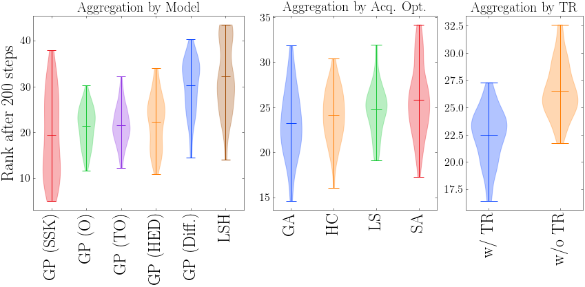
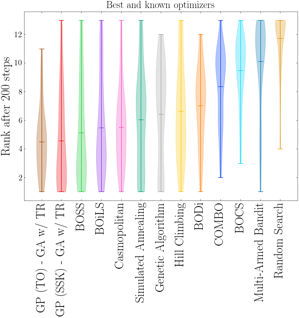
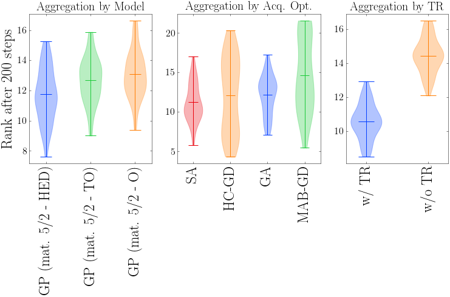
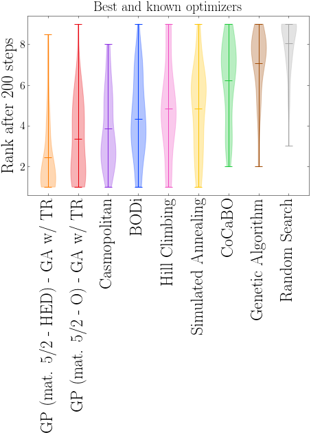

## Rank distribution symmetry

We show the actual rank distribution obtained after 200 optimization steps for optimizers or group of optimizers. 

---

#### Combinatorial task: per module aggregate  (associated to Fig. 2)

---

#### Combinatorial task: individual optimizers performance (associated to Fig. 3)

---

#### Mixed task: per module aggregate (associated to Fig. 6)

---
#### Mixed task: individual optimizers performance (associated to Fig. 7)

