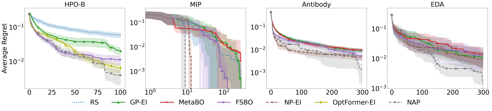

# NAP (Neural Acquisition Process)
This repository is the official implementation of [End-to-End Meta-Bayesian Optimisation with Transformer Neural Processes](https://arxiv.org/abs/2305.15930).
The code provided in this repo allows the user to train, validate and test NAP on `HPO-B and Antigen experiments.
## Setup
Setup a virtualenv/conda/miniconda environment with at least python3.8 and use the requirements.txt to install the dependencies. 
```commandline
# Example with virtualenv
sudo apt-get install python3.8-venv  # for Ubuntu 18.04 LTS
python3.8 -m venv nap_env
. nap_env/bin/activate
pip install --upgrade pip
pip install -r requirements.txt
```

## Training
To train NAP on HPO:
```commandline
PYTHONPATH=. python scripts/nap/train_nap_hpo.py
# if it complains about the number of opened files, first run
ulimit -Sn 10000
```

## Testing
Adjust the paths inside `scripts/nap/test_nap_hpo.py` and run the script.
```commandline
PYTHONPATH=. python scripts/nap/test_nap_hpo.py
```

## Results


## Cite us
```
@misc{maraval2023endtoend,
      title={End-to-End Meta-Bayesian Optimisation with Transformer Neural Processes}, 
      author={Alexandre Maraval and Matthieu Zimmer and Antoine Grosnit and Haitham Bou Ammar},
      year={2023},
      eprint={2305.15930},
      archivePrefix={arXiv},
      primaryClass={cs.LG}
}
```

## Contributors
Alexandre Max Maraval, Matthieu Zimmer, Antoine Grosnit, Haitham Bou Ammar

## License

- https://github.com/metabo-iclr2020/MetaBO is under GNU APGL-3.0 License.

