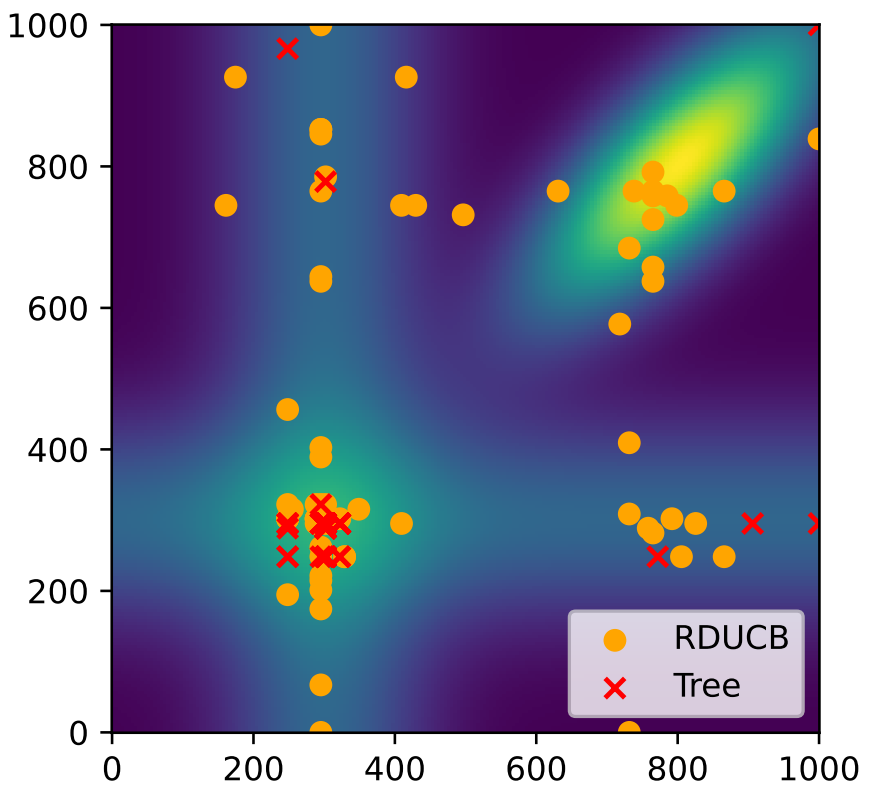

# Are Random Decompositions all we need in High Dimensional Bayesian Optimisation

This repository accompanies an [ICML 2023 publication](https://arxiv.org/pdf/2301.12844.pdf) by Juliusz Ziomek and Haitham Bou-Ammar.
The repository is largely based on code from [High-Dimensional Bayesian Optimization via Tree-Structured Additive Models](https://github.com/eric-vader/HD-BO-Additive-Models), as such the code in this repository is released under the original MIT license (in the LICENSE file) giving copyright to Eric Han, except for the parts that have been added or substantially modified, which are released under MIT licence giving copyrights to Huawei Technologies Co., Ltd. Such parts are clearly marked in code by comments.

<p align="center">
   
</p>

## Acknowledgements

1. The code here is largely derived from the [High-Dimensional Bayesian Optimization via Tree-Structured Additive Models ](https://github.com/eric-vader/HD-BO-Additive-Models) repository by Eric Han, Ishank Arora and Jonathan Scarlett.
2. The code in this repository is derived from the code base from [High-Dimensional Bayesian Optimization via Additive Models with Overlapping Groups](https://arxiv.org/pdf/1802.07028.pdf), supplied by Paul Rolland.
3. The code included in hdbo/febo is taken from [LineBO](https://github.com/kirschnj/LineBO). The paper accompanying the code is [Adaptive and Safe Bayesian Optimization in High Dimensions via One-Dimensional Subspaces](https://arxiv.org/abs/1902.03229).
4. The NAS-Bench-101 datasets included in `data/fcnet` is taken from [nas_benchmarks](https://github.com/automl/nas_benchmarks). The paper accompanying the code is [NAS-Bench-101: Towards Reproducible Neural Architecture Search](https://arxiv.org/pdf/1902.09635.pdf).
5. The lpsolve datasets included in `data/mps` is taken from the benchmark dataset in [MIPLIB 2017](https://miplib.zib.de/download.html). 

## Installation

We implemented all algorithms in Python 3.8.3. 

Minimum System requirements:

* `Linux 5.4.12-100`
* 5GB of space (Because of NAS-Bench-101 and lpsolve, if not just 100MB)

Prepare your environment:

1. If you don't have it already, [Install Conda](https://docs.conda.io/projects/conda/en/latest/user-guide/install/linux.html)
2. [Install MLflow](https://mlflow.org/) either on your system or in the base environment of Conda - `pip install mlflow`
3. Build and test environment by using the command `mlflow run .` (this may take a while).

Optional steps:
1. (Optional) Run `bash data/setup.sh` to download data from [NAS Benchmarks](https://github.com/automl/nas_benchmarks) and  into your home directory. You may skip this step if you are not running lpsolve and NAS-Bench-101 datasets.
2. (Optional) Run `pip install -U pandas matplotlib seaborn` in your base environment for plotting the results.  You may skip this step if you do not need the plotting script.

## Running experiments from Paper

You may run the configurations by using the command to specify the configuration, for example to run RDUCB on LassoBench:

```
mlflow run . -P param_file=config/LassoBench/rducb.yml
```

All the parameters of the run should be specified in the `.yml` file. However, to facilitate running batch jobs, one can include command line arguments to override the seed or subproblem. For example:

```
mlflow run . -P param_file=config/LassoBench/rducb.yml -P seed=1 -P sub_benchmark="pick_data:diabetes"
```
will run the experiment as specified in `config/LassoBench/rducb.yml` but will overwrite the seed to 1 and pick_data to diabetes. See an example of workflow in `example.sh`


## Visualising the results
In order to visualize the experiment, you can run `mlflow ui` and click on the experiments to visualize the metrics.

Alternatively to include multiple baselines in a plot and to produce confidence intervals, you can use the provided `plot.py` script. See `example.sh` for an example of a work flow running and plotting multiple runs.

## Troubleshooting
If you have problems with the SSL cetificate, a quick fix is to comment line 39 in hdbo.yml, which will skip the installation of LassoBench. If you want to use this benchmark, you can install LassoBench manually. To do that, first activate your mflow environment (you can find it on the list of all conda environments by typing `conda info --env`). Then run:
```
git clone https://github.com/ksehic/LassoBench.git
cd LassoBench/
```
Next comment line 7 in setup.py (in the LassoBech folder) and run:
```
wget https://github.com/QB3/sparse-ho/archive/master.zip
unzip master.zip
cd sparse-ho-master
python3 -m pip install -e.
cd ..
python3 -m pip install -e.
```
Everything should now be installed.
