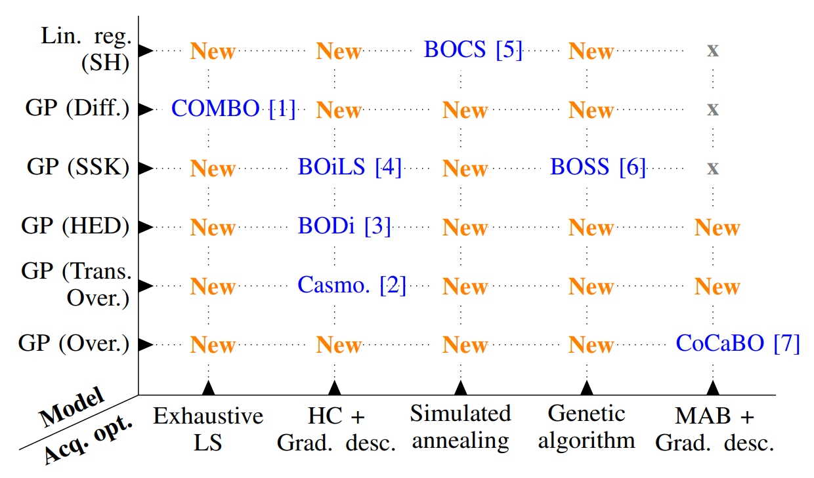
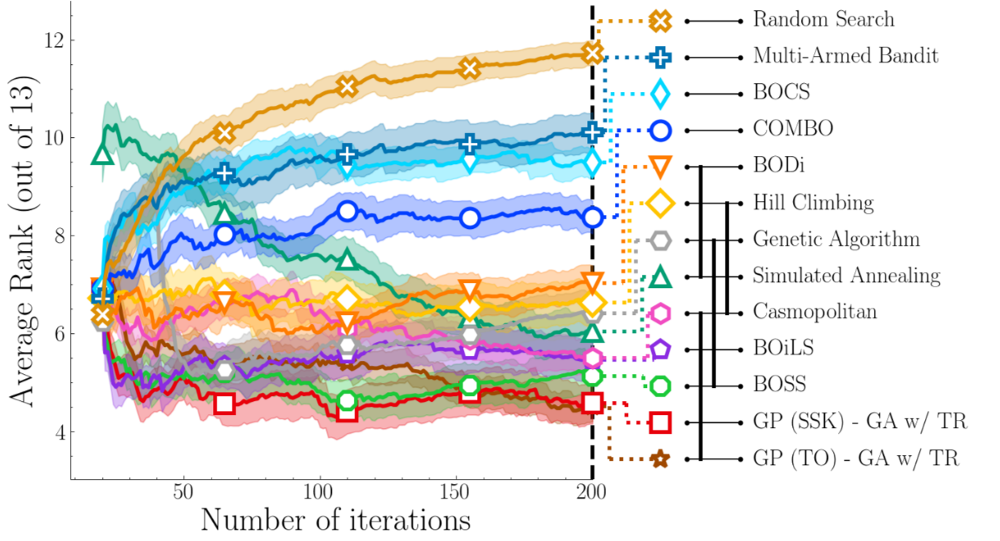
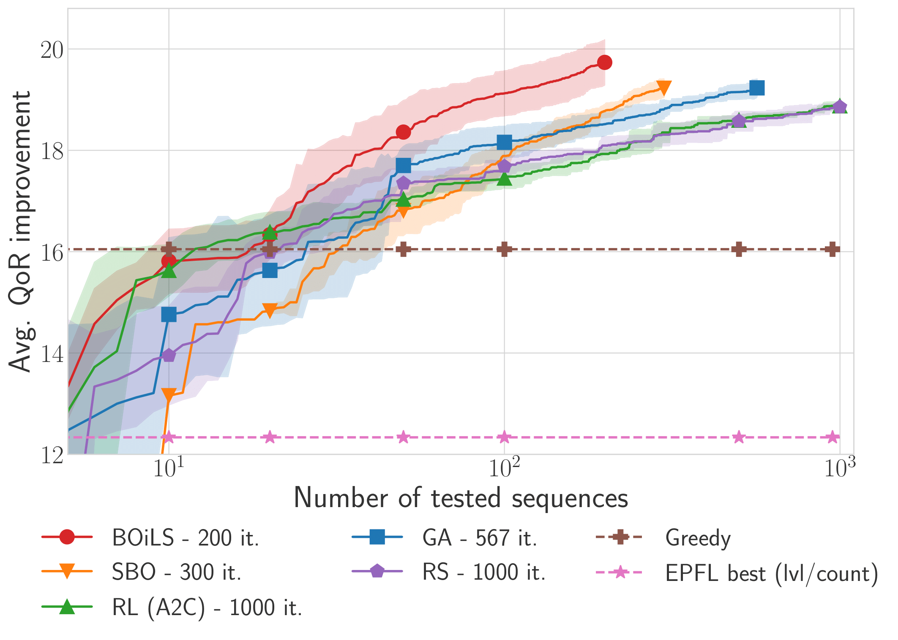
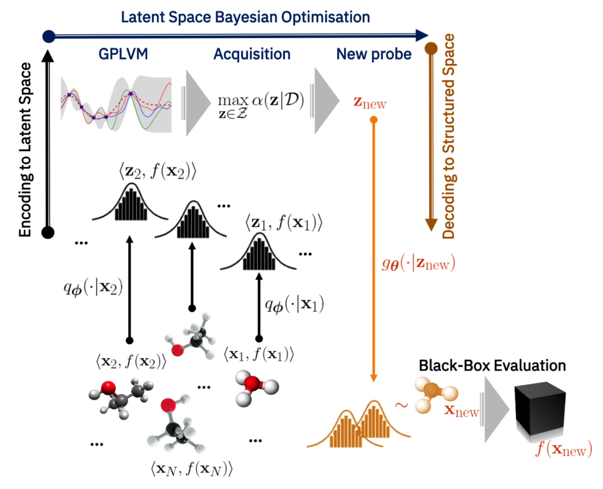
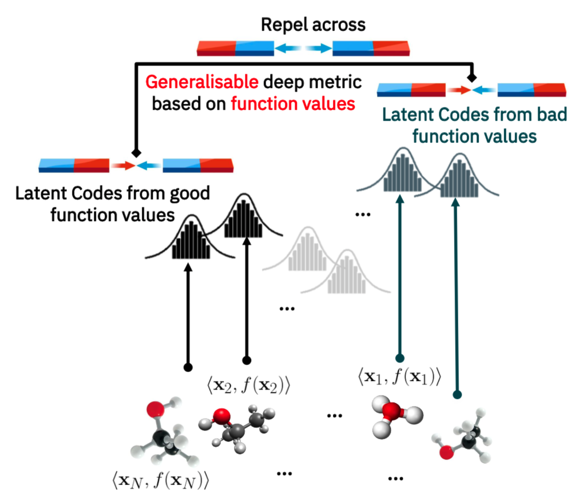
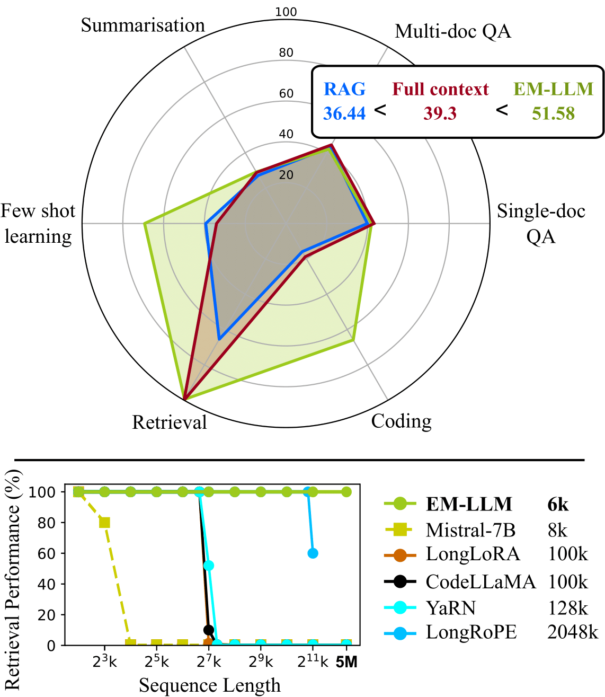

# Bayesian Optimization, Reinforcement Learning, & Generative Model Research

This directory contains official implementations for Bayesian Optimization, Reinforcement Learning, & Generative Model works developed by
Huawei, Noah's Ark Lab.

- Bayesian Optimisation Research
    - [HEBO: Heteroscedastic Evolutionary Bayesian Optimisation](./HEBO)
    - [MCBO: Framework and Benchmarks for Combinatorial and Mixed-variable Bayesian Optimization](./MCBO)
    - [NAP: End-to-End Meta-Bayesian Optimisation with Transformer Neural Processes](./NAP)
    - [RDUCB: High Dimensional Bayesian Optimisation with Random Decompositions](./RDUCB)
    - [AntBO: Antibody Design with Combinatorial Bayesian Optimisation](./AntBO)
    - [BOiLS: Bayesian Optimisation for Logic Synthesis](./BOiLS)
    - [T-LBO: BO in a latent space shaped by metric learning](./T-LBO)
    - [Bayesian Optimisation with Compositional Optimisers](./CompBO)
    - [AIRBO: Efficient Robust Bayesian Optimisation for Arbitrary Uncertain Inputs](./AIRBO)
- Reinforcement Learning Research
    - [Enhancing Reinforcement Learning Agents with Local Guides](RLLG)
    - [Sauté RL and Simmer RL: Safe Reinforcement Learning Using Safety State Augmentation ](./SIMMER)
    - [Model-Based Offline Reinforcement Learning with Pessimism-Modulated Dynamics Belief](./PMDB)
    - [SparsePO: Controlling Preference Alignment of LLMs via Sparse Token Masks](./SparsePO)
- Generative Model Research
    - [EM-LLM: Human-like Episodic Memory for Infinite Context LLMs](./EM-LLM)

Further instructions are provided in the README files associated to each project.

# Bayesian Optimisation Research

## [HEBO](./HEBO)

Bayesian optimization library developed by Huawei Noahs Ark Decision Making and Reasoning (DMnR) lab. The <strong>
winning submission </strong> to
the [NeurIPS 2020 Black-Box Optimisation Challenge](https://bbochallenge.com/leaderboard).

## [MCBO](./MCBO)

Codebase associated to: [Framework and Benchmarks for Combinatorial and Mixed-variable Bayesian Optimization
](https://arxiv.org/abs/2306.09803) accepted at **NeurIPS** (2023).

##### Abstract

This paper introduces a modular framework for Mixed-variable and Combinatorial
Bayesian Optimization (MCBO) to address the lack of systematic benchmarking
and standardized evaluation in the field. Current MCBO papers often introduce
non-diverse or non-standard benchmarks to evaluate their methods, impeding the
proper assessment of different MCBO primitives and their combinations. Additionally, papers introducing a solution for a
single MCBO primitive often omit
benchmarking against baselines that utilize the same methods for the remaining primitives. This omission is primarily
due to the significant implementation
overhead involved, resulting in a lack of controlled assessments and an inability
to showcase the merits of a contribution effectively. To overcome these challenges, our proposed framework enables an
effortless combination of Bayesian
Optimization components, and provides a diverse set of synthetic and real-world
benchmarking tasks. Leveraging this flexibility, we implement 47 novel MCBO
algorithms and benchmark them against seven existing MCBO solvers and five
standard black-box optimization algorithms on ten tasks, conducting over 4000
experiments. Our findings reveal a superior combination of MCBO primitives
outperforming existing approaches and illustrate the significance of model fit and
the use of a trust region. We make our MCBO library available under the MIT
license at https://github.com/huawei-noah/HEBO/tree/master/MCBO.

## [NAP: End-to-End Meta-Bayesian Optimisation with Transformer Neural Processes](./NAP/)

Codebase associated
to: [End-to-End Meta-Bayesian Optimisation with Transformer Neural Processes](https://arxiv.org/abs/2305.15930),
accepted at **NeurIPS** (2023).

##### Abstract

Meta-Bayesian optimisation (meta-BO) aims to improve the sample efficiency of Bayesian optimisation by leveraging data
from related tasks. While previous methods successfully meta-learn either a surrogate model or an acquisition function
independently, joint training of both components remains an open challenge. This paper proposes the first end-to-end
differentiable meta-BO framework that generalises neural processes to learn acquisition functions via transformer
architectures. We enable this end-to-end framework with reinforcement learning (RL) to tackle the lack of labelled
acquisition data. Early on, we notice that training transformer-based neural processes from scratch with RL is
challenging due to insufficient supervision, especially when rewards are sparse. We formalise this claim with a
combinatorial analysis showing that the widely used notion of regret as a reward signal exhibits a logarithmic sparsity
pattern in trajectory lengths. To tackle this problem, we augment the RL objective with an auxiliary task that guides
part of the architecture to learn a valid probabilistic model as an inductive bias. We demonstrate that our method
achieves state-of-the-art regret results against various baselines in experiments on standard hyperparameter
optimisation tasks and also outperforms others in the real-world problems of mixed-integer programming tuning, antibody
design, and logic synthesis for electronic design automation.

## [RDUCB: High Dimensional Bayesian Optimisation with Random Decompositions](./RDUCB)

   

Codebase associated
to: [Are Random Decomositions all we need in High Dimensional Bayesian Optimisation](https://arxiv.org/pdf/2301.12844.pdf)
accepted at **ICML** (2023).

##### Abstract

Learning decompositions of expensive-to-evaluate black-box functions promises to scale Bayesian optimisation (BO) to
high-dimensional
problems. However, the success of these techniques depends on finding proper decompositions
that accurately represent the black-box. While previous works learn those decompositions based
on data, we investigate data-independent decomposition sampling rules in this paper. We find
that data-driven learners of decompositions can be easily misled towards local decompositions
that do not hold globally across the search space. Then, we formally show that a random tree-based
decomposition sampler exhibits favourable theoretical guarantees that effectively trade
off maximal information gain and functional mismatch between the actual black-box and its
surrogate as provided by the decomposition. Those results motivate the development of the
random decomposition upper-confidence bound algorithm (RDUCB) that is straightforward
to implement - (almost) plug-and-play - and, surprisingly, yields significant empirical gains
compared to the previous state-of-the-art on a comprehensive set of benchmarks. We also
confirm the plug-and-play nature of our modelling component by integrating our method with
HEBO, showing improved practical gains in the highest dimensional tasks from Bayesmark.

## [AntBO: Antibody Design with Combinatorial Bayesian Optimisation](./AntBO)

Codebase associated
to: [AntBO: Towards Real-World Automated Antibody Design with Combinatorial Bayesian Optimisation](https://www.sciencedirect.com/science/article/pii/S2667237522002764)
published in **Cell Reports Method**s (2023).

##### Abstract

Antibodies are canonically Y-shaped multimeric proteins capable of highly specific molecular recognition. The CDRH3
region located at the tip of variable chains of an antibody dominates antigen-binding specificity. Therefore, it is a
priority to design optimal antigen-specific CDRH3 regions to develop therapeutic antibodies to combat harmful pathogens.
However, the combinatorial nature of CDRH3 sequence space makes it impossible to search for an optimal binding sequence
exhaustively and efficiently, especially not experimentally. Here, we present AntBO: a Combinatorial Bayesian
Optimisation framework enabling efficient in silico design of the CDRH3 region. Ideally, antibodies should bind to
their target antigen and be free from any harmful outcomes. Therefore, we introduce the CDRH3 trust region that
restricts the search to sequences with feasible developability scores. To benchmark AntBO, we use the Absolut! software
suite as a black-box oracle because it can score the target specificity and affinity of designed antibodies in silico
in an unconstrained fashion. The results across 188 antigens demonstrate the benefit of AntBO in designing CDRH3 regions
with diverse biophysical properties. In under 200 protein designs, AntBO can suggest antibody sequences that outperform
the best binding sequence drawn from 6.9 million experimentally obtained CDRH3s and a commonly used genetic algorithm
baseline. Additionally, AntBO finds very-high affinity CDRH3 sequences in only 38 protein designs whilst requiring no
domain knowledge. We conclude AntBO brings automated antibody design methods closer to what is practically viable for
in vitro experimentation.

## [BOiLS: Bayesian Optimisation for Logic Synthesis](./BOiLS)

    

Codebase associated to: [BOiLS: Bayesian Optimisation for Logic Synthesis](https://arxiv.org/abs/2111.06178) accepted
at **DATE22** conference.

##### Abstract

Optimising the quality-of-results (QoR) of circuits during logic synthesis is a formidable challenge necessitating the
exploration of exponentially sized search spaces. While expert-designed operations aid in uncovering effective
sequences, the increase in complexity of logic circuits favours automated procedures. Inspired by the successes of
machine learning, researchers adapted deep learning and reinforcement learning to logic synthesis applications. However
successful, those techniques suffer from high sample complexities preventing widespread adoption. To enable efficient
and scalable solutions, we propose BOiLS, the first algorithm adapting modern Bayesian optimisation to navigate the
space of synthesis operations. BOiLS requires no human intervention and effectively trades-off exploration versus
exploitation through novel Gaussian process kernels and trust-region constrained acquisitions. In a set of experiments
on EPFL benchmarks, we demonstrate BOiLS's superior performance compared to state-of-the-art in terms of both sample
efficiency and QoR values.

## [T-LBO: BO in a latent space shaped by metric learning](./T-LBO)

  
   

Codebase associated
to: [High-Dimensional Bayesian Optimisation with Variational Autoencoders and Deep Metric Learning](https://arxiv.org/abs/2106.03609)

##### Abstract

We introduce a method based on deep metric learning to perform Bayesian optimisation over high-dimensional, structured
input spaces using variational autoencoders (VAEs). By extending ideas from supervised deep metric learning, we address
a longstanding problem in high-dimensional VAE Bayesian optimisation, namely how to enforce a discriminative latent
space as an inductive bias. Importantly, we achieve such an inductive bias using just 1% of the available labelled data
relative to previous work, highlighting the sample efficiency of our approach. As a theoretical contribution, we present
a proof of vanishing regret for our method. As an empirical contribution, we present state-of-the-art results on
real-world high-dimensional black-box optimisation problems including property-guided molecule generation. It is the
hope that the results presented in this paper can act as a guiding principle for realising effective high-dimensional
Bayesian optimisation.

## [Bayesian Optimisation with Compositional Optimisers](./CompBO)

</>

Codebase associated
to: [Are we Forgetting about Compositional Optimisers in Bayesian Optimisation?](https://www.jmlr.org/papers/v22/20-1422.html)
accepted at **JMLR**.

##### Abstract

Bayesian optimisation presents a sample-efficient methodology for global optimisation. Within this framework, a crucial
performance-determining subroutine is the maximisation of the acquisition function, a task complicated by the fact that
acquisition functions tend to be non-convex and thus nontrivial to optimise. In this paper, we undertake a comprehensive
empirical study of approaches to maximise the acquisition function. Additionally, by deriving novel, yet mathematically
equivalent, compositional forms for popular acquisition functions, we recast the maximisation task as a compositional
optimisation problem, allowing us to benefit from the extensive literature in this field. We highlight the empirical
advantages of the compositional approach to acquisition function maximisation across 3958 individual experiments
comprising synthetic optimisation tasks as well as tasks from Bayesmark. Given the generality of the acquisition
function maximisation subroutine, we posit that the adoption of compositional optimisers has the potential to yield
performance improvements across all domains in which Bayesian optimisation is currently being applied.

## [AIRBO](./AIRBO)

Codebase associated
to: [Efficient Robust Bayesian Optimization for Arbitrary Uncertain Inputs](https://arxiv.org/abs/2310.20145)

##### Abstract

Bayesian Optimization (BO) is a sample-efficient optimization algorithm widely employed across various applications. In
some challenging BO tasks, input uncertainty arises due to the inevitable randomness in the optimization process, such
as machining errors, execution noise, or contextual variability. This uncertainty deviates the input from the intended
value before evaluation, resulting in significant performance fluctuations in the final result. In this paper, we
introduce a novel robust Bayesian Optimization algorithm, AIRBO, which can effectively identify a robust optimum that
performs consistently well under arbitrary input uncertainty. Our method directly models the uncertain inputs of
arbitrary distributions by empowering the Gaussian Process with the Maximum Mean Discrepancy (MMD) and further
accelerates the posterior inference via Nystrom approximation. Rigorous theoretical regret bound is established under
MMD estimation error and extensive experiments on synthetic functions and real problems demonstrate that our approach
can handle various input uncertainties and achieve state-of-the-art performance.

# Reinforcement Learning Research

## [Enhancing Reinforcement Learning Agents with Local Guides](./RLLG)

Codebase associated
to [paper: Enhancing Reinforcement Learning Agents with Local Guides](https://hal.science/hal-04052358/file/Final_Reinforcement_Learning_with_Local_Guides.pdf)

##### Abstract

This paper addresses the problem of integrating local guide policies into a Reinforcement Learning agent. For this, we
show how
to adapt existing algorithms to this setting before introducing a
novel algorithm based on a noisy policy-switching procedure. This
approach builds on a proper Approximate Policy Evaluation (APE)
scheme to provide a perturbation that carefully leads the local
guides towards better actions. We evaluated our method on a set
of classical Reinforcement Learning problems, including safetycritical systems where the agent cannot enter some areas
at the
risk of triggering catastrophic consequences. In all the proposed
environments, our agent proved to be efficient at leveraging those
policies to improve the performance of any APE-based Reinforcement Learning algorithm, especially in its first learning
stages.

## [Sauté RL and Simmer RL: Safe Reinforcement Learning Using Safety State Augmentation](./SIMMER)

Codebase associated to: [Sauté RL: Almost Surely Safe RL Using State Augmentation](https://arxiv.org/pdf/2202.06558.pdf)
and  [Enhancing Safe Exploration Using Safety State Augmentation](https://arxiv.org/pdf/2206.02675.pdf).

##### Abstract for Sauté RL: Almost Surely Safe RL Using State Augmentation (ICML 2022)

Satisfying safety constraints almost surely (or with probability one) can be critical for deployment of Reinforcement
Learning (RL) in real-life applications. For example, plane landing and take-off should ideally occur with probability
one. We address the problem by introducing Safety Augmented (Saute) Markov Decision Processes (MDPs), where the safety
constraints are eliminated by augmenting them into the state-space and reshaping the objective. We show that Saute MDP
satisfies the Bellman equation and moves us closer to solving Safe RL with constraints satisfied almost surely. We argue
that Saute MDP allows to view Safe RL problem from a different perspective enabling new features. For instance, our
approach has a plug-and-play nature, i.e., any RL algorithm can be "sauteed". Additionally, state augmentation allows
for policy generalization across safety constraints. We finally show that Saute RL algorithms can outperform their
state-of-the-art counterparts when constraint satisfaction is of high importance.

##### Abstract for Effects of Safety State Augmentation on Safe Exploration (NeurIPS 2022)

Safe exploration is a challenging and important problem in model-free reinforcement learning (RL). Often the safety cost
is sparse and unknown, which unavoidably leads to constraint violations -- a phenomenon ideally to be avoided in
safety-critical applications. We tackle this problem by augmenting the state-space with a safety state, which is
nonnegative if and only if the constraint is satisfied. The value of this state also serves as a distance toward
constraint violation, while its initial value indicates the available safety budget. This idea allows us to derive
policies for scheduling the safety budget during training. We call our approach Simmer (Safe policy IMproveMEnt for
RL) to reflect the careful nature of these schedules. We apply this idea to two safe RL problems: RL with constraints
imposed on an average cost, and RL with constraints imposed on a cost with probability one. Our experiments suggest
that simmering a safe algorithm can improve safety during training for both settings. We further show that Simmer can
stabilize training and improve the performance of safe RL with average constraints.

## [Model-Based Offline Reinforcement Learning with Pessimism-Modulated Dynamics Belief](./PMDB)

Code associdated
to: [Model-Based Offline Reinforcement Learning with Pessimism-Modulated Dynamics Belief](https://nips.cc/Conferences/2022/Schedule?showEvent=54842)
accepted
at **NeurIPS (2022)** conference.

#### Abstract

Model-based offline reinforcement learning (RL) aims to find highly rewarding policy, by leveraging a previously
collected static dataset and a dynamics model. While learned through reuse of static dataset, the dynamics model's
generalization ability hopefully promotes policy learning if properly utilized. To that end, several works propose to
quantify the uncertainty of predicted dynamics, and explicitly apply it to penalize reward. However, as the dynamics and
the reward are intrinsically different factors in context of MDP, characterizing the impact of dynamics uncertainty
through reward penalty may incur unexpected tradeoff between model utilization and risk avoidance. In this work, we
instead maintain a belief distribution over dynamics, and evaluate/optimize policy through biased sampling from the
belief. The sampling procedure, biased towards pessimism, is derived based on an alternating Markov game formulation
of offline RL. We formally show that the biased sampling naturally induces an updated dynamics belief with
policy-dependent reweighting factor, termed *Pessimism-Modulated Dynamics Belief*. To improve policy, we devise an
iterative regularized policy optimization algorithm for the game, with guarantee of monotonous improvement under certain
condition. To make practical, we further devise an offline RL algorithm to approximately find the solution. Empirical
results show that the proposed approach achieves state-of-the-art performance on a wide range of benchmark tasks.

## [SparsePO: Controlling Preference Alignment of LLMs via Sparse Token Masks](.SparsePO)

Code associated with the paper "[SparsePO: Controlling Preference Alignment of LLMs via Sparse Token Masks](https://arxiv.org/abs/2410.05102)"

#### Abstract

Preference Optimization (PO) has proven an effective step for aligning language models to human-desired behaviors. 
Current variants, following the offline Direct Preference Optimization objective, have focused on a strict setting where all tokens 
are contributing signals of KL divergence and rewards to the loss function. However, human preference is not affected by each word in 
a sequence equally but is often dependent on specific words or phrases, e.g. existence of toxic terms leads to non-preferred responses. 
Based on this observation, we argue that not all tokens should be weighted equally during PO and propose a flexible objective 
termed SparsePO, that aims to automatically learn to weight the KL divergence and reward corresponding to each token during PO training. 
We propose two different variants of weight-masks that can either be derived from the reference model itself or learned on the fly.
Notably, our method induces sparsity in the learned masks, allowing the model to learn how to best weight reward and KL divergence
contributions at the token level, learning an optimal level of mask sparsity. Extensive experiments on multiple domains, 
including sentiment control, dialogue, text summarization and text-to-code generation, illustrate that our approach assigns meaningful 
weights to tokens according to the target task, generates more responses with the desired preference and improves reasoning tasks by 
up to 2 percentage points compared to other token- and response-level PO methods.

# Generative Model Research

## [EM-LLM: Human-like Episodic Memory for Infinite Context LLMs](./EM-LLM)

Code associated with our EM-LLM paper: [[arXiv]](https://arxiv.org/abs/2407.09450).

  

#### Abstract

Large language models (LLMs) have shown remarkable capabilities, but still struggle with processing extensive contexts, limiting their ability to maintain coherence and accuracy over long sequences. In contrast, the human brain excels at organising and retrieving episodic experiences across vast temporal scales, spanning a lifetime. In this work, we introduce EM-LLM, a novel approach that integrates key aspects of human episodic memory and event cognition into LLMs with no fine-tuning, enabling them to handle practically infinite context lengths while maintaining computational efficiency. EM-LLM organises sequences of tokens into coherent episodic events using a combination of Bayesian surprise and graph-theoretic boundary refinement in an online fashion. When needed, these events are retrieved through a two-stage memory process, combining similarity-based and temporally contiguous retrieval for efficient and human-like access to relevant information. Experiments on the LongBench and $\infty$-Bench benchmarks demonstrate EM-LLM's superior performance, consistently outperforming the state-of-the-art retrieval model InfLLM across various baseline LLMs. In addition, EM-LLM outperforms its popular counterpart, RAG, in a wide range of tasks, while requiring similar resources. Notably, EM-LLM's performance even surpasses full-context models in most tasks, while successfully performing retrieval across 5 million tokens -- a scale computationally infeasible for such models. Finally, our analysis reveals strong correlations between EM-LLM's event segmentation and human-perceived events, suggesting a bridge between this artificial system and its biological counterpart, thereby offering a novel computational framework for exploring human memory mechanisms.
