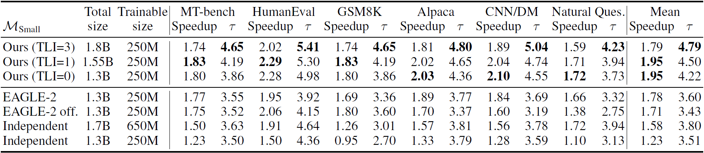
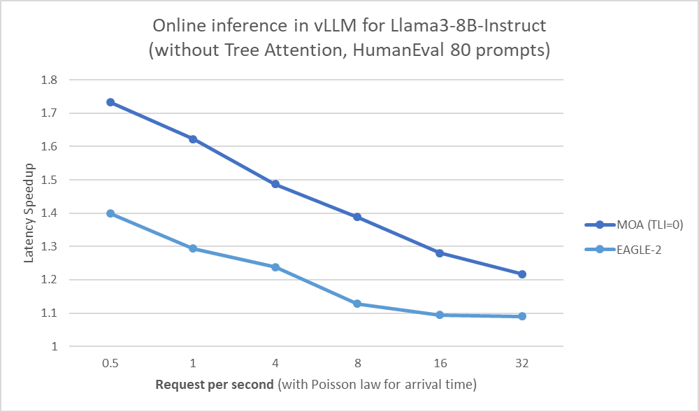

# Mixture of Attentions for Speculative Decoding

This repository contains the implementation of the paper "[Mixture of Attentions For Speculative Decoding](https://arxiv.org/abs/2410.03804)" by Matthieu Zimmer*, Milan Gritta*, Gerasimos Lampouras, Haitham Bou Ammar, and Jun Wang. The paper introduces a novel architecture for speculative decoding that enhances the speed of large language model (LLM) inference.

## Overview

The Mixture of Attentions architecture addresses several limitations of existing speculative decoding methods by introducing:
- **Layer Self-Attention**: Mitigates partial observability by aggregating token information across layers.
- **Cross-Attention**: Improves on-policyness and training efficiency.
- **Target Layer Inference**: Balances computational efficiency and prediction accuracy by reusing layers of the LLM.

## Installation

To get started with the project, clone the repository and install the required dependencies:

```bash
git clone --branch mixture-of-attentions --single-branch https://github.com/huawei-noah/HEBO.git mixture-of-attentions
cd mixture-of-attentions

conda create --name moa_spec python=3.10
conda activate moa_spec
pip install -r requirements.txt
```

Ensure you have Python 3.10 or later installed.

## Usage

### Training

To train the model, use the provided training script. You can adjust the configuration parameters in the `configs` directory.

```bash
# assume you have 4 GPUs, otherwise adapt the --num-processes argument
accelerate launch --num-processes=4 --config_file configs/deepspeed/stage0.yaml moa_spec/train.py

# the target layer can be adjusted inside configs/method/moa_spec.yaml or with
accelerate launch --num-processes=4 --config_file configs/deepspeed/stage0.yaml moa_spec/train.py method.model_config.target_layer_inference=1

# training EAGLE
accelerate launch --num-processes=4 --config_file configs/deepspeed/stage0.yaml moa_spec/train.py method=eagle

# training independent model
accelerate launch --num-processes=4 --config_file configs/deepspeed/stage0.yaml moa_spec/train.py method=independent drafter="andrijdavid/Llama3-1B-Base"
```

### Evaluation

#### Single device

To evaluate the model on SpecBench:

```bash
python moa_spec/evaluation.py drafter=logs/train_XXX/snapshot.XXX.pt
```

To compare it with vanilla decoding (no speculation):

```bash
python moa_spec/evaluation.py method=vanilla
```

To compare it with EAGLE-2:

```bash
python moa_spec/evaluation.py method=eagle drafter=logs/train_XXX/snapshot.XXX.pt
```

To compare it with an independent model (with tree decoding):
```bash
python moa_spec/evaluation.py method=independent drafter=logs/train_XXX/snapshot.XXX.pt
```

We obtained the following results. Note that the speedup ratio is dependent on the GPU and CPU. 



#### vLLM
We implemented our approach in vLLM without tree decoding to support higher batch sizes and continuous batching.
We wrote our code for vLLM version v0.6.3.post2.dev14.

```bash
# to install our patched vLLM
cd vllm
CUDACXX=/usr/local/cuda-12.1/bin/nvcc VLLM_USE_PRECOMPILED=1 pip install --editable .

# convert MOA checkpoints to vLLM format with our script
python convert_checkpoint.py ../logs/train_XXX/snapshot.XXX.pt/ ../logs/train_XXX/snapshot.XXX.pt.vllm/

vllm serve "meta-llama/Meta-Llama-3-8B-Instruct" --speculative-model ../logs/train_XXX/snapshot.XXX.pt.vllm/ --num_speculative_tokens 3 --max-model-len 2048 --dtype bfloat16 --enforce-eager
```

We obtained the following results with vLLM with benchmark_serving.py:



#### Client-Server
This code hasn't been cleaned yet. If you're interested, please leave an issue or email us.

### Configuration

To use a model other than Llama, you can specify a Hugging Face model by providing its name, 
such as "meta-llama/Meta-Llama-3-8B", or by specifying the path to the model. 
This can be done for both training and inference in the command line.

```bash
model="meta-llama/Meta-Llama-3-8B"
```

The configuration files are located in the `configs` directory. These files allow you to customize various aspects of the training and evaluation process, such as learning rate, batch size, and model architecture.


## Citation

If you use this code in your research, please cite the paper:

```bibtex
@misc{zimmer2024mixtureattentionsspeculativedecoding,
      title={Mixture of Attentions For Speculative Decoding}, 
      author={Matthieu Zimmer and Milan Gritta and Gerasimos Lampouras and Haitham Bou Ammar and Jun Wang},
      year={2024},
      eprint={2410.03804},
      archivePrefix={arXiv},
      primaryClass={cs.CL},
      url={https://arxiv.org/abs/2410.03804}, 
}
```

## License

This project is licensed under the MIT License. See the [LICENSE](LICENSE) file for more details.

Disclaimer: This open source project is not an official Huawei product, Huawei is not expected to provide support for this project.