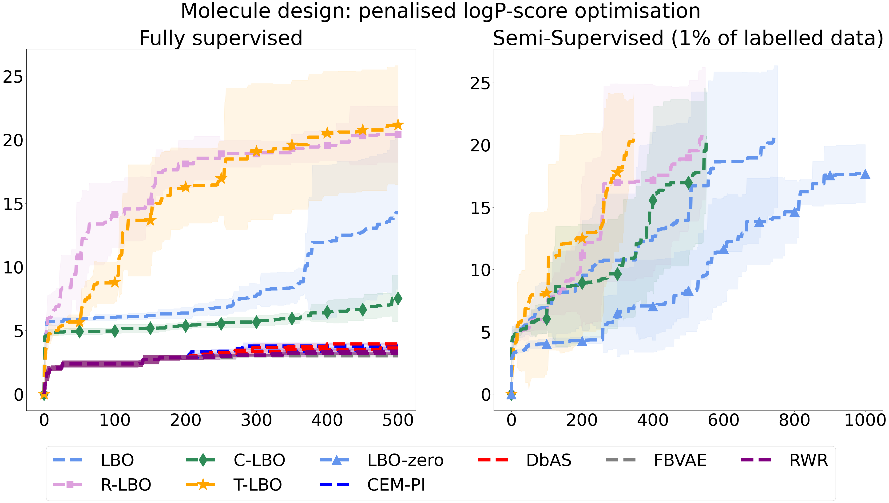
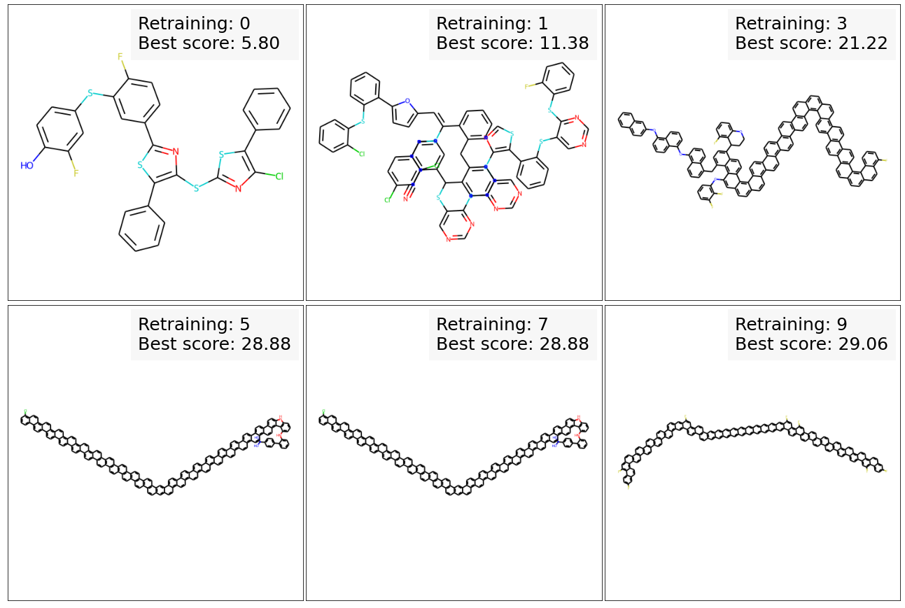

# High-Dimensional Bayesian Optimisation withVariational Autoencoders and Deep Metric Learning

This repository is the official implementation of 
[High-Dimensional Bayesian Optimisation withVariational Autoencoders and Deep Metric Learning](https://arxiv.org/abs/2106.03609).

The provided code allows to re-run the experiments presented in the paper, including:
- an implementation of soft contrastive and soft triplet losses in
[metrics.py](./weighted_retraining/weighted_retraining/metrics.py).
- [scripts](./weighted_retraining/scripts/models/) to train VAE with metric learning based on black-box function values
 for the three tasks considered in our paper:
    - Expression Reconstruction
    - Topology Shaping Fitting 
    - Chemical Design
- [scripts](./weighted_retraining/scripts/robust_opt/) to run LSBO under fully supervised and semi-supervised settings.

## Contributors 

<strong> Antoine Grosnit and Rasul Tutunov and Alexandre Max Maraval and Ryan-Rhys Griffiths and Alexander I. Cowen-Rivers and Lin Yang and Lin Zhu and Wenlong Lyu and Zhitang Chen and Jun Wang and Jan Peters and Haitham Bou-Ammar </strong>

## Installation 

First, install dependencies.
We recommend using [miniconda](https://docs.conda.io/en/latest/miniconda.html) to install dependencies,
as [rdkit](http://www.rdkit.org/)
(a dependency used for the chemical design experiment)
is partucularly difficult to install otherwise.

Setup was run on `Python 3.7` with CUDA 10.1

:warning: Make sure that `cuda` device is compatible with installed version of `torch`
```shell script
conda env create -f lsbo_metric_env.yml
conda activate lsbo_metric_env
```

To run experiments you need to define a folder where results will be stored: 
- create file `utils/data_storage_root_path.txt` and specify a one-line absolute path to the folder
 where results and data should be stored (e.g. `~/LSO-storage/`)
 ```shell script
echo '~/LSO-storage/' > ./utils/storage_root_path.txt
```

## Usage guide

In each script invoked below, default parameters are the same as the ones we used to run the experiments. 
Nonetheless user can still modify the scripts to run model training
 / BO under a specific setting, e.g. with a specific metric loss or acquisition function. 
 
 We give instructions for each task on how to download the datasets we used in our experiments, how to train VAE model 
 (or which pretrained model can be used) and how to run Bayesian Optimisation.
 
 Set `cuda` parameter in the scripts or use CUDA_VISIBLE_DEVICES=0 to run just on a specific GPU.

To train a VAE or run LSBO with a specific metric learning loss or with target-prediction,
 set the `metric_loss_ind` or `predict_target` parameters in the training / optimisation scripts.


### Expression task:
##### Set up the data
-  Set up the data with [`expr_dataset.py`](./weighted_retraining/weighted_retraining/expr/expr_dataset.py)
 after downloading and unzipping expression data from [weighted-retraining repo](https://github.com/cambridge-mlg/weighted-retraining/raw/master/assets/data/expr/)
 ```shell script
# download necessary files and unzip data
url=https://github.com/cambridge-mlg/weighted-retraining/raw/master/assets/data/expr/
expr_dir="./weighted_retraining/assets/data/expr"
mkdir $expr_dir
for file in eq2_grammar_dataset.zip equation2_15_dataset.txt scores_all.npz;
do
  cmd="wget -P ${expr_dir} ${url}${file}"
  echo $cmd 
  $cmd
done
unzip "$expr_dir/eq2_grammar_dataset.zip" -d "$expr_dir"

# split data and generate datasets used in our BO experiments
python ./weighted_retraining/weighted_retraining/expr/expr_dataset.py \
            --ignore_percentile 65 --good_percentile 5 \
            --seed 0 --save_dir weighted_retraining/data/expr
 ```

##### Train a grammar VAE
- Train a grammar VAE with [`train-expr-pt.sh`](weighted_retraining/scripts/models/supervised/train-expr-pt.sh) 
(modify the script to select GPU id and other parameters if needs be):
```shell script
chmod u+x ./weighted_retraining/scripts/models/supervised/train-expr-pt.sh
./weighted_retraining/scripts/models/supervised/train-expr-pt.sh
```

##### Run LSBO
- Run LSBO with [`robust_opt_expr.sh`](./weighted_retraining/scripts/robust_opt/robust_opt_expr.sh):
```shell script
chmod u+x ./weighted_retraining/scripts/robust_opt/robust_opt_expr.sh
./weighted_retraining/scripts/robust_opt/robust_opt_expr.sh
```

### Topology task:
##### Set up the data
- The data can be downloaded from the following git repo: 
[`Neural Networks for Topology Optimization`](https://github.com/ISosnovik/top) then place the unzipped files 
into your `DATA_STORAGE_ROOT/data/topology_data/` (see [`utils_save.py`](./utils/utils_save.py) to check your 
`DATA_STORAGE_ROOT`).

##### Train a VAE
- Train the VAE model by running [`train-topology.sh`](weighted_retraining/scripts/models/supervised/train-topology.sh) with
```shell script
chmod u+x ./weighted_retraining/scripts/models/supervised/train-topology.sh
./weighted_retraining/scripts/models/supervised/train-topology.sh
```
- To run LSBO, execute run [`robust_opt_topology.sh`](./weighted_retraining/scripts/robust_opt/robust_opt_topology.sh) 
(and selecting the desired parameters within the shell such as metric learning, acquisition, number of acquisition steps,
 ...)
```shell script
chmod u+x ./weighted_retraining/scripts/robust_opt/robust_opt_topology.sh
./weighted_retraining/scripts/robust_opt/robust_opt_topology.sh
```

### Molecule task:
##### Set up data
**Note**: preprocessing the chemical dataset will take _several hours_ :coffee:.
-  To download and build the `Zinc250k` dataset with black-box functions labels, execute 
[`setup-chem.sh`](./weighted_retraining/scripts/data/setup-chem.sh)
 ```shell script
# download necessary files
url=https://github.com/cambridge-mlg/weighted-retraining/raw/master/assets/data/chem_orig_model
molecule_dir="./weighted_retraining/assets/data/chem_orig_model/"
mkdir $molecule_dir
for file in train.txt val.txt vocab.txt README.md;
do
  wget -P $molecule_dir "$url/$file"
done

# preprocess molecule data for BO experiments
chmod u+x ./weighted_retraining/scripts/data/setup-chem.sh
./weighted_retraining/scripts/data/setup-chem.sh
 ```

##### Get JTVAE
- The pretrained JTVAE used for our experiments can be obtained from 
[weighted-retraining repo](https://github.com/cambridge-mlg/weighted-retraining/raw/master/assets/pretrained_models/):

```shell script
url=https://github.com/cambridge-mlg/weighted-retraining/raw/master/assets/pretrained_models/chem.ckpt
wget -P ./weighted_retraining/assets/pretrained_models/chem_vanilla/ $url
```

- To train the JTVAE with metric loss or target prediction - to be used for the BO - run 
[train_chem.sh](./weighted_retraining/scripts/models/supervised/train-chem.sh) with desired options:
```shell script
chmod u+x ./weighted_retraining/scripts/models/supervised/train-chem.sh
./weighted_retraining/scripts/models/supervised/train-chem.sh
```


##### Run LSBO
- Run optimization experiments with [`robust_opt_chem.sh`](./weighted_retraining/scripts/robust_opt/robust_opt_chem.sh)
 (and selecting the desired parameters within the shell such as metric learning, acquisition, number of acquisition steps,
 ...)
```shell script
chmod u+x ./weighted_retraining/scripts/robust_opt/robust_opt_chem.sh
./weighted_retraining/scripts/robust_opt/robust_opt_chem.sh
```

## Results

### Regret Visualisation

The function [plot_results()](./utils/utils_plot.py) can be used to show the evolution of the 
regret across acquisition steps displaying the mean and standard deviation when the experiment has
been carried out on several seeds. 


### Our results on chemical design

|  |Nb. Function evaluations |Penalized logP (top-3)|
| --- | --- | --- |
| T-LBO | 7750 | 38.57 / 34.83 / 34.63|
| T-LBO | 3450 | 34.83 / 31.1 / 29.21|
| T-LBO | 2300 | 24.06 / 22.84 / 21.26|

#### Optimisation of penalised logP

We optimised the penalised water-octanol partition coefficient (logP) objective of molecules from the ZINC250K dataset
and compared seval optimisation algorithms, showing that the highest logP scores are obtained with our methods **T-LBO**.

#### Molecule visualisation

**T-LBO** – Starting with observation of **only 3% of labelled data points** in *Zinc250K*
 the best molecule initially available (displayed on the top-left corner) has a penalised logP score of 4.09.
  Under semi-supervised setup, our method manages to find a molecule with score **29.14** after only 
  six retrainings of the **JTVAE with triplet loss** (bottom right molecule).

## Cite Us

Grosnit, Antoine, et al. "High-Dimensional Bayesian Optimisation with Variational Autoencoders and Deep Metric Learning." arXiv preprint arXiv:2106.03609 (2021).

## BibTex
```
# BitbTex
@misc{grosnit2021highdimensional,
      title={High-Dimensional Bayesian Optimisation with Variational Autoencoders and Deep Metric Learning}, 
      author={Antoine Grosnit and Rasul Tutunov and Alexandre Max Maraval and Ryan-Rhys Griffiths and Alexander I. Cowen-Rivers and Lin Yang and Lin Zhu and Wenlong Lyu and Zhitang Chen and Jun Wang and Jan Peters and Haitham Bou-Ammar},
      year={2021},
      eprint={2106.03609},
      archivePrefix={arXiv},
      primaryClass={cs.LG}
}
```

## Acknowledgements
- Thanks to the authors of the [`Sample-Efficient Optimization in the Latent Space of
Deep Generative Models via Weighted Retraining`](https://github.com/cambridge-mlg/weighted-retraining)
  for providing their implementations of high-dimensional BO based on weighted-retraining VAE,
   which we based parts of our code on.
- Thanks to the authors of the [`pytorch-metric-learning`](https://github.com/KevinMusgrave/pytorch-metric-learning) 
project for providing their implementations of `torch`-based metric learning tools we adapted to our approach.
- Thanks to the authors of the [`Neural Networks for Topology Optimization`](https://github.com/ISosnovik/top) 
project for providing their dataset, which we have used for one of our black-box optimisation experiments.
